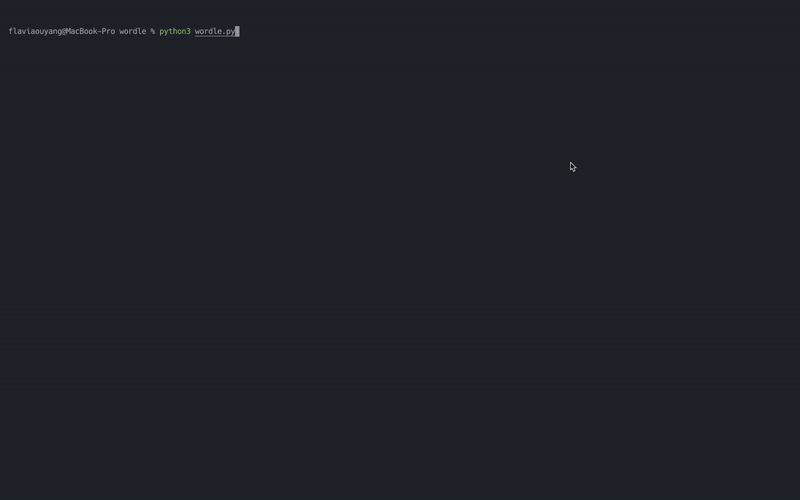

# CLI Wordle by FO

## WHAT IS IT

- A command-line wordle game written purely in Python
- [Wordle](https://www.nytimes.com/games/wordle/index.html) is a puzzle game where the player will try to guess a five-letter word in six tries. The game is originally created by **Josh Wardle**.
	- Note: In this implementation, the player only get five tries.

## DEMO

## RUN ON YOUR MACHINE

1. clone the repository: `git clone https://github.com/flaviaouyang/wordle-clone.git`
2. install requirements: `pip3 install -r requirements.txt`
3. run: `python3 wordle.py`

## TECH & LIBRARY

- This project is written in 100% Python
- Library used:
	- `colorama`
	- `rich`
	- `english_words`

## LICENSE

This program is under the [MIT License](LICENSE).
